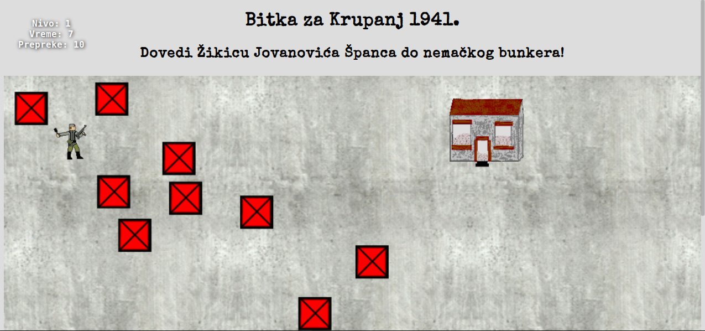

[](https:-mudroljub.github.io/igrica-partizani/)

# Partisan Games ★

Male igrice o Nemcima i partizanima.

## TODO

- raketi ne radi proveriGranice, nastavlja neograničeno da leti, ispitati log

BombasScena
- mitraljez puca iz bunkera
    - da bunker ispaljuje više raketa
    - raketa ne cilja dobro kad je bombas preblizu
    - dodati prepreka kao zaklone
    - dodati završni prozor kad ga ubije raketa
- BUG: pobedim, vreme se nastavlja, na kraju vreme isteklo, izgubio si
- sukcesivno se povećava broj prepreka i težina igre
- možda brojati koliko bunkera može uništiti zaredom pre smrti?

Scena1942
- probati da tenkovi dolaze i pucaju
- srediti ispravljanje gore dole dok leti

Scena1944
- dodati stvar za hvatanje (paketić)
- ubaciti jednog neprijatelja
- senku ispod aviona, kao u avion.png

TopScena
- neprijatelji nadiru
- dodati više projektila

CamacScena
- beskonačan ekran nadesno
- mozda ubaciti obale da promiču
- nailazi na prepreke, stenje, brodolomnike, čamce, krstarice, brodove....

OtpisaniScena
- BUG: nekad se ne pojavi odmah
- BUG: mrtav reaguje na pogodak
- da se u nekom trenutku okrene i pripuca
- da ih izlazi više
    - dodati druge spite-ove
- dodati zavrsniEkran

TenkicIde
- BUG: raketa ne leti lepo
- tenkovi, bunkeri, vojnici...

RanjenikScena
- prikazati prozore umesto log
- preimenovati u ranjenici na sutjesci
- povecavati broj patrola
- spojiti Bekstvo iz Jasenovca i RanjenikPaljba?
- u jasenovcu beton i trebalo bi ustase, a na sutjesci nemci, italijani, cetnici

TenkOdozgoScena
- scena kao velika mapa lavirint
- kretanje po vise ekrana, kamera prati igraca
- razlicite podloge ubrzavaju/usporavaju tenk
- pobeda/poraz - prepreke ili vreme

### 3D
- dodati predmetima z osu (default 0)
- integrisati https:-github.com/mudroljub/partisans
- dodati neke 3D igre, poput Savo i napad na aerodrom
- srediti 3D koliziju

### Test
- proveriti sve nivoe sa sporijim i bržim fps

## Dokumentacija

### Scena

`Scena` automatski poziva razne metode, koje nasledne scene mogu implementirati.

Metode koje poziva jednom:

```js
init()
```

Metode koje poziva na klik:

```js
handleClick = () => {}
```

#### Glavna petlja

Metode koje Scena poziva unutar glavne petlje:

```js
loop(dt, t) {
    this.proveriTipke(dt)
    this.update(dt, t)
    this.cisti()
    this.render(dt, t)
    this.sablon()
}
```

Ako dodamo predmet sceni, Scena na njemu svaki frejm poziva sledeće metode:

```js
predmet.proveriTipke()
predmet.update()
    predmet.proveriGranice()
predmet.render()
```

Ako predmeti imaju druge predmete unutar sebe, i njihove metode će se rekurzivno pozivati.

Ako predmet nije dodat sceni, onda ove metode pozivamo ručno. 

Scenu okončavamo na `end()`, što zaustavlja animaciju, čisti šablone iz DOM-a, prazni predmete, zaustavlja zvuke i slično. U naslednim scenama je potrebno ukloniti sve dodate događaje.

### Platno

Platno vodi računa o veličini ekrana. Podrazumevano je to veličina scene.

### Mish

Mish vodi računa o svemu što se tiče kursora, njegovoj poziciji, izgledu, itd.
